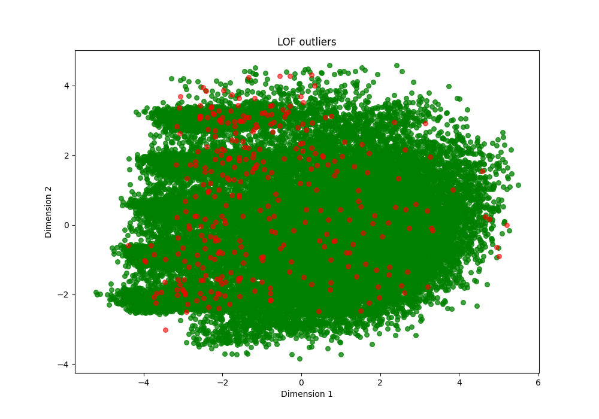
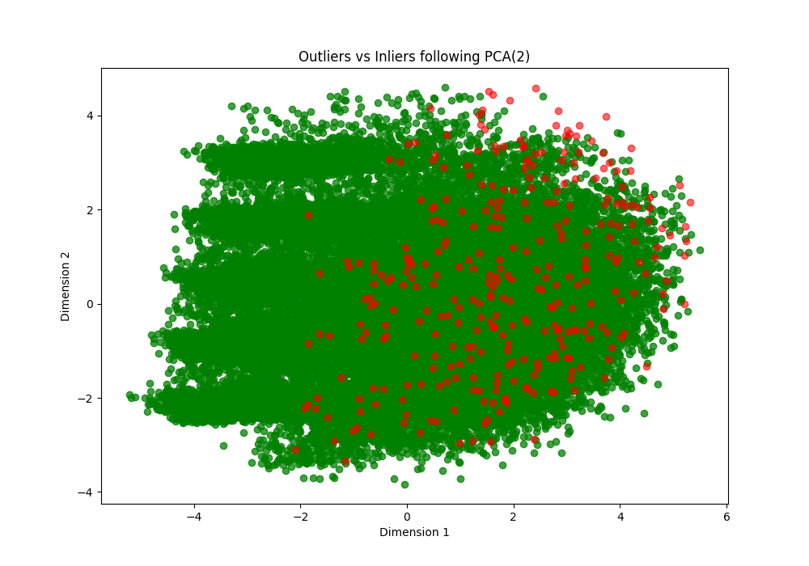
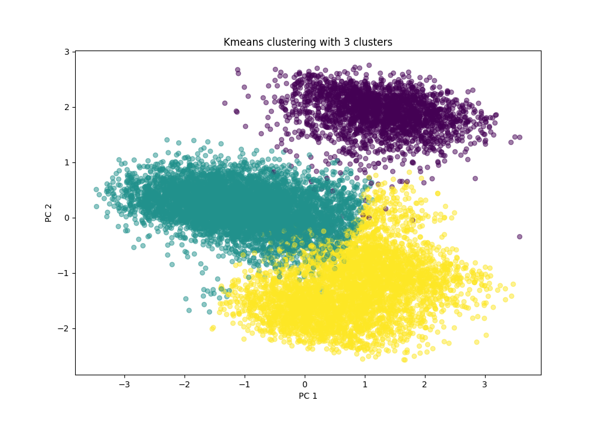
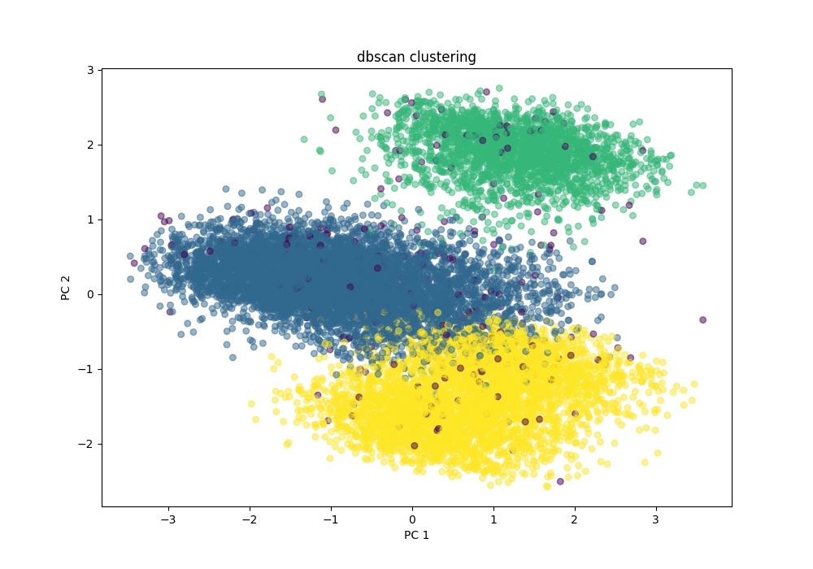

# CMPT 454 – Airline Survey Analysis Project
Fall 2024\
Yun Fei Chen (\<student number\>)\
David Krljanovic (301427415)

## Table of Contents

- [Introduction](#introduction)

- [Preprocessing](#preprocessing)

- [Exploratory Data Analysis](#exploratory-data-analysis)

- [Clustering](#clustering)

- [Classification](#classification)

- [Conclusions](#conclusions)

## Introduction
Spirit Airlines Inc. is a popular American airline known for it's affordable airfare, and poor service and overall customer experience. Frequent delays, uncomfortable seats, and questionably terrible in-flight service plagues travelers on their journies to their target destinations. One could argue that the sole purpose of a plane is to transport people from point A to point B, and that selling an experience is not a necessity. This begs the question: Does the quality of these services actually influence the satisfaction of airline customers to a significant degree? This is a good question to ask – a business certainly does not wish to deter its target demographics from considering them for future travels. It is worth noting that as of recent, Spirit Airlines stock has fallen ninety-five percent in the the last year, and the company has filed for bankruptcy. 

Using a [Kaggle-sourced dataset](https://www.kaggle.com/datasets/teejmahal20/airline-passenger-satisfaction/data) containing over 100,000 airline customer satisfaction survey results of 24 features, we will perform data mining techniques to uncover hidden patterns and information that may prove to be useful to data scientists and businesses alike. Following a routine preprocessing of the data, exploratory data analysis will reveal surface level information that will serve to guide the procedure of machine learning clustering and classification tasks. Each section will serve as an overview of our procedure, and the final section will conclude our findings and attempt to present a meaningful discovery.

## Preprocessing

## Exploratory Data Analysis

Before running data mining tasks such as clustering and classification, it is important that we have some basic understandings concerning the distribution of our dataset. We can determine simple relationships and trends using basic inferential statistics and visualization techniques. We also decided to take a closer look at the relationships between specific key features that may help explain the results of future analysis in the clustering and classification tasks.

### Airline Classes:

Our first instinct was that the airline classes would have a disparity between reported satisfaction, and we fully expected to see business class have a significantly higher count of satisfied customers over the economy and economy plus classes. Our instincts were correct: when we plotted a seaborn bar plot of the count of satisfied and dissatisfied/neutral customers for each class, the business class was not only the class with the highest count of satisfied customers, but it was also the only class with the majority of customers satisfied. 

Our analysis on classes did not end here, however. When we plotted the age distribution of customers across each class using a seaborn histogram, we found that the means of the distributions appeared to be different:

Applying the ANOVA test to the different age distributions of each class, we found that there is most definitely a significant difference of the means between the different airline classes (p-value of 1.05e-228). Following this result, we ran post-hoc analysis using a scipy Tukey Test, which indeed determined that all the age distributions had mean ages that significantly differed from one another.

From both the class satisfaction bar plot and the age distribution histogram results, we inferred the following:

- Airline class strongly influences the satisfaction of customers. When running classification algorithms, we have a strong predictor of satisfaction.

- The mean customer age of each airline class is significantly different; since airline class and age are related, and class and satisfaction are related, we can say that the two features are associated, and age is a somewhat reliable predictor of satisfaction. 

### Flight Distances:

We also sought a relationship between continuous features. Two features that stood out to us were the 'Flight Distance' and 'Arrival Delay in Minutes' feature; we were expecting that on longer flights, the room for estimation error by the airline grew larger, which could contribute to arrival delays. However, this was not the case. Before plotting the features against each other, we removed all records that had a departure delay greater than 0 minutes. This is done to prevent comparing arrival delays with flight distances where the departure delay is likely influencing arrival delay the most. Finally, plotting 'Flight Distance' against 'Arrival Delay in Minutes', we find no evidence of strong linear correlation, with a correlation coefficient of r = 0.0268. 

Perhaps we were not looking deep enough – we decided to break down the data further by dividing data into satisfied and dissatisfied/neutral groups. Again, we found no evidence of linear correlation (r = 0.0422 and 0.059). There does not appear to be any direct linear relationship between arrival delay and flight distances within these contexts. 

As a follow-up, we were curious whether the Flight Distance, a predetermined statistic for each customer, would influence the results of satisfaction among customers. What we were surprised to find was that the mean flight distance for satisfied customers happened to be over 600 kilometers greater than non-satisfied customers. 

Could this be a sign that airlines are aware that longer flights are more taxing on travellers, and so they provide a higher standard of service than on shorter flights?

### Heatmapping:

Instead of checking each pair of features for any signs of correlation manually, we were able to do it all at once using a correlation matrix, enabled by the data preprocessing that handled categorical features. By using the pandas DataFrame corr() function on our preprocessed data and the seaborn library, we were able to discover more interesting correlational relationships in our dataset:

What immediately stood out is a moderate positive correlation between Flight Distance and customers flying in business class, and a moderate negative correlation between Flight Distance and customers flying in economy class. Knowing what we learned using barplots to plot satisfaction against airline class, now our discovery that satisfied customers have a longer average flight distance is much more clear. If business class flyers are more likely to be on longer flights, and economy class flyers are less likely to be on longer flights, then the proportion of satisfied customers with longer flight times will likely be much higher among satisfied customers, since satisfied customers are typically business class flyers. 

Very similar results are evident in the type of travel; customers flying for business are more likely to travel with business class. We wondered if we plotted the satisfaction of business vs personal travellers, whether we would find similar results to the plot of airline class vs satisfaction, and we did. Business travelers, of which business class flyers make up a bigger proportion than Personal travelers, report higher satisfaction levels than economy flyers, and the majority of business travelers report satisfaction:

The heatmap also identifies a consistent correlation disparity between the different elements of a flight experience and airline classes as well. Business class typically positively correlates with a greater customer satisfaction in each service, and economy class typically negatively correlates. Moreover, the different categories of in-flight experience influence each other as well. For example, a higher satisfaction in flight cleanliness positively correlates moderately with satisfaction in the food a drink category. The common correlations of features may also pose a problem to the clustering task.

## Outlier Detection

Outlier detection is the removal of datapoints that signficantly deviate from the main distribution of data. To do this task, we leveraged the use of Local Outlier Factor (LOF) and Isolation forest methods. Using the preprocessed data, we first made the decision to randomly sample the data in favour of efficiency; LOF is a computationally demanding model, and our dataset of over 100,000 records was taking too long to process. Furthermore, we scaled the data using sklearn's standardScalar function. This was done because LOF is a distance dependant method, and differing scales of data will affect the models ability to appropriately classify outliers. We scaled both LOF and Isolation forest to get a fair comparison. Following scaling and sampling, we fit each of the datasets to their specified and reduced data dimensionality to two dimensions using Principal Component Analysis (PCA). Following dimensionality reduction, we plotted a scatterplot the results of each method by separating the data into respective dataframes of inliers and outliers, distinguishing dataframe membership by colour (green and red, respectively).

### LOF (n_neighbors=20, contamination=0.01)

### Isolation Forest (contamination=0.01)

The results of each outlier detection method, although seemingly different in the visualization, were not particularily useful. Many of the points categorized as outliers appeared to belong to the inlier class, deep within the single cluster of data. The conclusion that we drew from this result was that the data had possible already been cleaned prior to our own preprocessing. Some of the chosen points appear to be on the edge of the cluster of data, but too many of the points are present deep in the cluster too label all of the selected points as noise. Adjusting contamination parameters did not improve performance either. We made the decision to not remove the chosen points from the dataset prior to the clustering and classifiaction tasks as there was not enough convincing edivdence that these points were majority noise.

## Clustering

Clustering for this dataset was especially difficult. One of the problems with the dataset that our heatmap uncovered during the EDA task was that much of the data was in some way correlated. Correlated data is bad for clustering algorithms – it negatively impacts data in such a way that makes it difficult for clustering tasks to distinguish meaningful groupings of data. In order to get valuable results from this (preprocessed) dataset, we had to manually select groupings of features that were not correlated using pandas' drop function. The more columns we dropped, the higher the silhouette scores would be, but we did not want to drop too many features in fear of losing information. Even after dropping several columns of data, the silhouette score functions were not reporting promising results. 

We tested clustering using many diffrent models, but settled on KMeans and DBSCAN as they were outputting the highest silhouette scores. Prior to running each clustering algorithm, we first scaled the data using sklearn's standardScalar function. This is done so that the data can be effectively visualized within a common range, and also because both KMeans and DBSCAN use distance metrics to cluster objects together. In Kmeans Clustering, the hyperparameters were set as n_cluster=3 and init='kmeans'++. 3 clusters was yielding the highest silhouette scores, and we felt that kmeans++ was more optimal over random initialization. For DBSCAN, hyperparameter eps was set to 2.1 and min_samples was set to 100. These hyperparameters were determined expirimentally. Following clutsering, the dimensionality of the data was reduced to 2 using PCA for visualization purposes:

### KMeans:

### DBSCAN:

The sillhouete scores for KMeans and DBSCAN were very close, typically both around 0.210. This score is not terrible, but it is very weak. When we add back the clustering results of KMeans to the preoprocessed data prior to dropping features, we can determine trends by assessing the mean and median values of each feature within each cluster.

 Looking at the printed results, we find that the largest mean proportion of satisfied customers (73%) lies within the cluster of which the majority of customers belong to business class (78%). This is unsurprising, given that in our heatmap and other analysis from EDA, we discovered a strong relationship between airline class and satisfaction. Within this same cluster is also almost entirely comprised of loyal customers, who are typically older and fly greater distances than the other clusters. It would seem that from this data, that older, long distance business class fliers are for the most part, satisfied with their service. 

 On the other hand, another cluster the same proportion of loyal customers (nearly 100%) as our previously discussed clusters, but only has rougly 11% of its customers satisfied! 80% of these customers are in the economy class, 12% are in economy plus, and the final 8% of customers are business class. Even if all of those 10% satisfied customers came from the economy class, that would still mean that 70% of loyal economy class fliers will return to this particular airline despite their dissatisfaction. This is quite a valuable finding! It means that loyal economy fliers do not need to be satisfied in order to return to this using this airline. We cannot be certain as to why, but we know that the satisfaction of economy class fliers is not as important as that of the business class fliers.

## Feature selection

## Classification

## Conclusions

